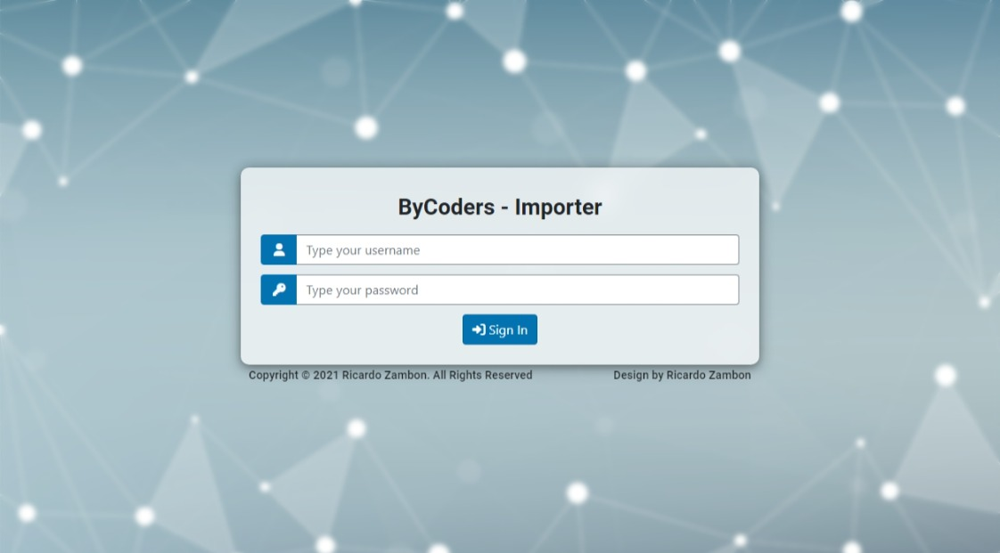
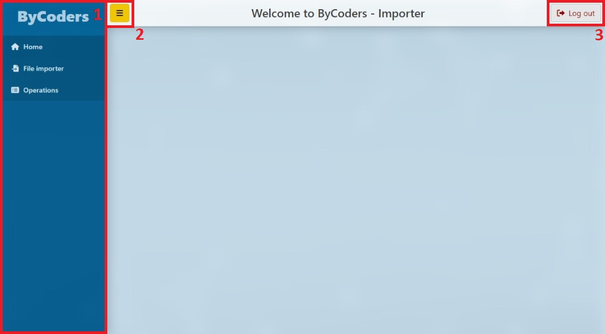
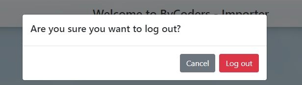
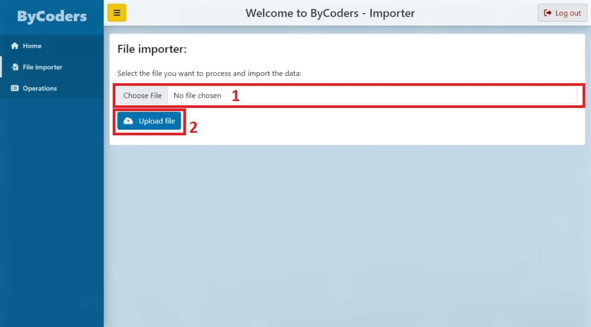
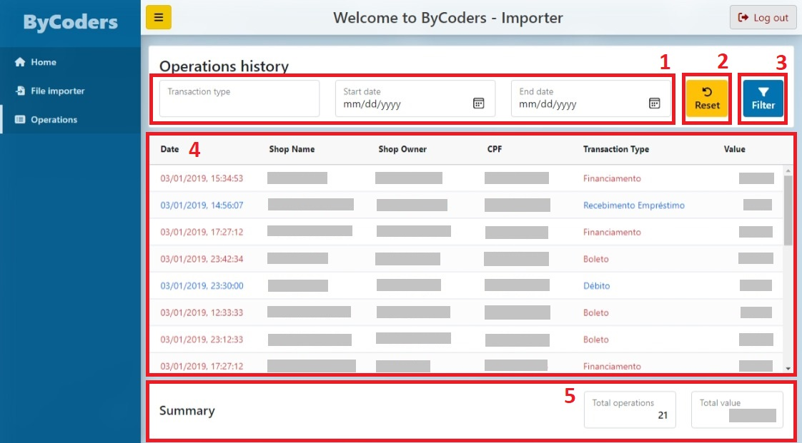

# ByCoders - Coding Challenge

## Front-end Documentation

This file intends to explain the front-end project.

- **Development URL:** https://localhost:4200 *HTTPS*
- **Docker-compose:** http://localhost:8080

### Login page



The login page is displayed by default when trying access the application without previous authentication, you need provide a valid username and password to proceed to the Home.

For development / tests purposes you can use the following demo account:

```
Username: ricardo.zambon
Password: zambon
```

### Home layout



The home layout is the user interface while navigating during the application.

- **1 Navigation:** Menu options to navigate to different pages. Default display is expanded, but is possible collapse to display only the icons<br />
*In small devices the navigation is hidden by default to reduce the consumed space.*

- **2 Menu Expand/Collapse:** This button expands / collapse the menu.

- **3 Log out:** Clickin in this button will display a confirmation message before logging out, clicking in **Log out** confirm the action and redirect the user to the login page.<br />


### File Importer page



The File Importer page is designed to upload CNAB files with client transactions.

- **1 Choose file:** Select the CNAB file to upload. This field is mandatory.

- **2 Upload file:** Clicking in upload file will process and return the result (success or fail).<br />
*Example of success message: The file was uploaded and imported with success!*

### Operations page



The Operations page is designed to display the historical transactions.

- **1 Filters:** Is possible filter the transactions accordingly to the **Transaction Type**, **Start Date**, and/or **End Date**. Filters are not mandatory.
  - **Transaction type:*8 Lists the available transaction types. Default value is empty.
  - **Start date:** Minimum transaction date to list. Formatted as system date/time locale. Default value is empty.
  - **End date:** Maximum transaction date to list. Formatted as system date/time locale. Default value is empty.

- **2 Reset:** Reset the filters to the original values.

- **3 Filter:** Filter the transactions accordingly to the criteria, if no criteria is informed, will display all transactions.

- **4 Transations list:** Displays the transactions, default displays all transactions. This list is divided by blocks of 100 rows, scrolling to the last row will automatically load the next block.
  - **Date:** Transaction date/time formatted as en-US locale.
  - **Shop name:** Shop name from the transaction.
  - **Shop owner:** Shop owner name from the transaction.
  - **CPF:** Shop owner tax id from the transaction.
  - **Transaction type:** The type of the transaction.
  - **Value:** The transaction value.
  - *List records are formatted accordingly to their value, red for negative values (**Withdraws**), blue for positive values (**Deposits**).*
  
- **5 Summary:** Displays the summary from the transactions list, if filtered, will display the summary from the filtered values only.
  - **Total operations:** Total number of rows in transactions list.
  - **Total value:** The sum of the transactions value.<br />
  *Total value is formatted accordingly to the value, red if negative, blue if positive.*
